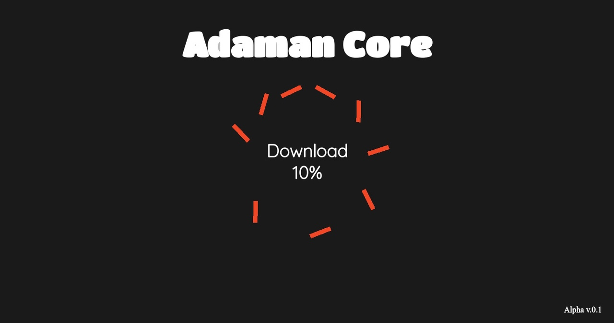

<h1>Main Core API {Alpha 👋🏻}</h1>

<i>Adaman Core</i> - основная часть <b>API</b> {10%} 

Version Description List <b>{Alpha v.0.1}</b>

<ul>
    <li>Main page created </li>
    <li>...</li>
</ul>

